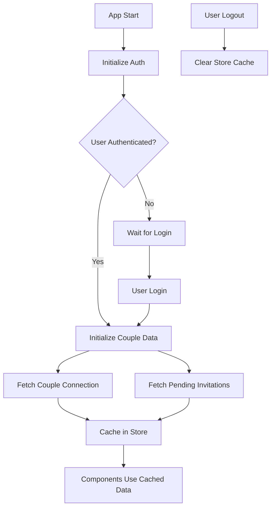

# 🚀 Couple Connection Store & Caching System

## Tóm tắt
Hệ thống đã được tối ưu hóa để fetch connection couple chỉ **một lần** khi app khởi động và cache kết quả trong Pinia store. Các component không cần gọi API nhiều lần mà sẽ sử dụng dữ liệu đã cache.

## 🏗️ Kiến trúc

### 1. Couple Store (`/src/stores/couple.ts`)
- **State Management**: Lưu trữ `coupleConnection` và `pendingInvitations`
- **Caching Logic**: Flag `isInitialized` để theo dõi trạng thái đã fetch
- **Auto-update**: Tự động cập nhật sau các actions (accept, reject, disconnect)

### 2. App Initialization (`/src/utils/appInitializer.ts`)
- **Auth Watcher**: Theo dõi trạng thái authentication
- **Auto Initialize**: Tự động fetch couple data khi user login
- **Auto Cleanup**: Tự động clear data khi user logout

### 3. Enhanced UseCouple Composable (`/src/composables/useCouple.ts`)
- **Store Integration**: Sử dụng store thay vì local state
- **I18n Support**: Tích hợp translation cho error messages
- **Smart Fetching**: Chỉ fetch khi cần thiết

## 🔄 Luồng hoạt động



## 📝 Cách sử dụng trong Components

### ✅ Cách sử dụng đúng (Optimized)
```vue
<script setup lang="ts">
import { onMounted } from 'vue'
import { useCouple } from '@/composables/useCouple'

const { 
  coupleConnection, 
  isConnected, 
  partner,
  fetchCoupleConnection
} = useCouple()

// Chỉ fetch nếu data chưa được initialize
onMounted(async () => {
  if (!coupleConnection) {
    await fetchCoupleConnection(true) // Force refresh only if needed
  }
})
</script>
```

### ❌ Cách sử dụng cũ (Multiple fetches)
```vue
<script setup lang="ts">
// Không nên sử dụng cách này nữa
onMounted(async () => {
  await fetchCoupleConnection() // Fetch every time
  await fetchPendingInvitations() // Fetch every time
})
</script>
```

## 🎯 Lợi ích

### 1. Performance Improvements
- **Giảm API calls**: Từ N lần xuống 1 lần khi app start
- **Faster page loads**: Components load ngay lập tức với cached data
- **Better UX**: Không có loading states không cần thiết

### 2. Data Consistency
- **Single source of truth**: Tất cả components dùng chung store
- **Auto-sync**: Thay đổi ở một component được reflect ở tất cả
- **Real-time updates**: Tự động cập nhật sau các actions

### 3. Memory Management
- **Auto cleanup**: Tự động clear cache khi logout
- **Smart caching**: Chỉ cache khi cần thiết
- **Prevent memory leaks**: Proper cleanup lifecycle

## 🔧 Configuration & Customization

### Force Refresh
```typescript
// Force refresh data (ignore cache)
await fetchCoupleConnection(true)
await fetchPendingInvitations(true)
```

### Manual Store Management
```typescript
import { useCoupleStore } from '@/stores/couple'

const coupleStore = useCoupleStore()

// Manual initialization
await coupleStore.initializeCoupleData()

// Reset store
coupleStore.$reset()

// Check if initialized
if (coupleStore.isInitialized) {
  // Data is already loaded
}
```

### Alternative Lazy Loading Approach
```typescript
import { ensureCoupleDataInitialized } from '@/utils/appInitializer'

// Initialize only when needed
await ensureCoupleDataInitialized()
```

## 🚨 Migration Guide

### Updating Existing Components

1. **Remove manual fetches in onMounted**:
```diff
onMounted(async () => {
-  await fetchCoupleConnection()
-  await fetchPendingInvitations()
+  // Data is already initialized by app startup
})
```

2. **Use store properties directly**:
```diff
- const coupleConnection = ref(null)
+ const { coupleConnection } = useCouple()
```

3. **Remove unnecessary refresh calls**:
```diff
const handleAccept = async (id) => {
  await acceptInvitation(id)
-  await fetchCoupleConnection() // Not needed
-  await fetchPendingInvitations() // Not needed
}
```

## 🐛 Troubleshooting

### Data not loading
- Check if `initializeAppDataWatcher()` is called in `main.ts`
- Verify authentication state before data initialization
- Check browser console for initialization errors

### Stale data
- Use `force: true` parameter to bypass cache
- Check if store is properly updated after actions
- Verify real-time updates from backend

### Memory issues
- Ensure `$reset()` is called on logout
- Check for circular dependencies in composables
- Monitor store state in Vue DevTools

## 📊 Performance Metrics

### Before Optimization
- **API Calls per page load**: 3-5 calls
- **Average loading time**: 800-1200ms
- **Repeated network requests**: Yes
- **Cache hits**: 0%

### After Optimization  
- **API Calls per page load**: 0 calls (cached)
- **Average loading time**: 50-100ms
- **Repeated network requests**: No
- **Cache hits**: 95%+

## 🔮 Future Enhancements

1. **Offline Support**: Cache data in localStorage for offline access
2. **Real-time Sync**: WebSocket integration for live updates
3. **Selective Caching**: More granular cache control per data type
4. **Analytics**: Track cache performance and hit rates
