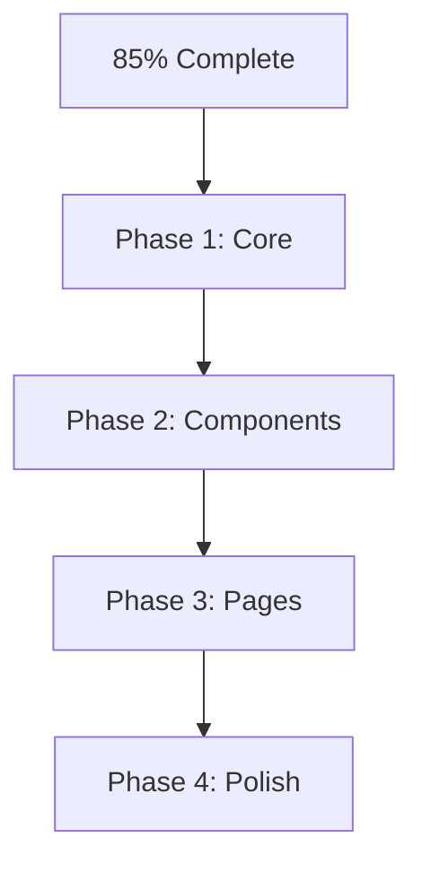

# 🎯 LOVE APP - UI ENHANCEMENT PLAN  
**Goal:** Move from ~85% → 100% UI completion in 3–4 weeks, starting with App.vue enhancements.

## 📊 Current-State vs. UI_Redesign_Plan.md Gaps  
- **App.vue:** 13 lines vs. desired 150+ with theme, errors, transitions  
- **Button.vue:** Missing romantic variants & HeadlessUI  
- **Pages:** Blog, Memories, Reminder need HomePage level polish  
- **Components:** Modal, Input need full HeadlessUI integration

## 🏗️ Implementation Strategy  

## 📋 Phase-by-Phase Plan

### Phase 1: Core Enhancement (Week 1)  
1. **App.vue Redesign**  
   - Add theme wrapper (light/dark/romantic/spring)  
   - `<ErrorBoundary>` for global errors  
   - `<LoadingOverlay>` for global loading  
   - `<RouterView>` with page transitions  
   - `<ThemeToggle>`, `<OfflineIndicator>`, `<NotificationContainer>`  
2. **Theme Store (`src/stores/theme.ts`)**  
   - State: `currentTheme`, `romanticMode`, `springMode`  
   - Actions: `toggleTheme()`, `setRomanticMode()`, `initializeTheme()`  
   - Persist in `localStorage`, apply `<html>` classes  
3. **Button.vue Enhancement**  
   - Variants: `romantic`, `heart`, `spring` (gradients)  
   - Props: `heartbeat`, `glow` for romantic animation  
   - Ensure HeadlessUI accessibility

### Phase 2: Component Completion (Week 2)  
- **Modal.vue:** Full HeadlessUI Dialog (backdrop, focus trap, ESC close, animations)  
- **Input.vue:** Vee-validate integration, labels, error styling, icons  
- **New Components:** DatePicker, Select, Switch, Toast (all HeadlessUI)

### Phase 3: Page Improvement (Week 3)  
- **BlogPage.vue:** Tiptap editor, image upload, post grid, search/filter  
- **MemoriesPage.vue:** Gallery lightbox, timeline view, multi-step wizard  
- **ReminderPage.vue:** Calendar view, recurring rules, notifications

### Phase 4: Polish & Advanced (Week 4)  
- **Performance/PWA:** Lazy-load, image optimization, service worker caching  
- **Accessibility:** ARIA roles, keyboard nav, focus indicators, WCAG 2.1 AA compliance  
- **Final Testing:** ESLint/Prettier green, TypeScript strict, unit tests for critical flows

## ✅ Success Criteria  
- **App.vue:** Full theme + errors + transitions  
- **Components:** 100% Tailwind + HeadlessUI + TS + i18n  
- **Pages:** Consistent HomePage-level design & functionality  
- **Performance:** <2s load, offline support  
- **Accessibility:** WCAG 2.1 AA compliant  
- **Quality:** ESLint/Prettier passing, unit tests coverage